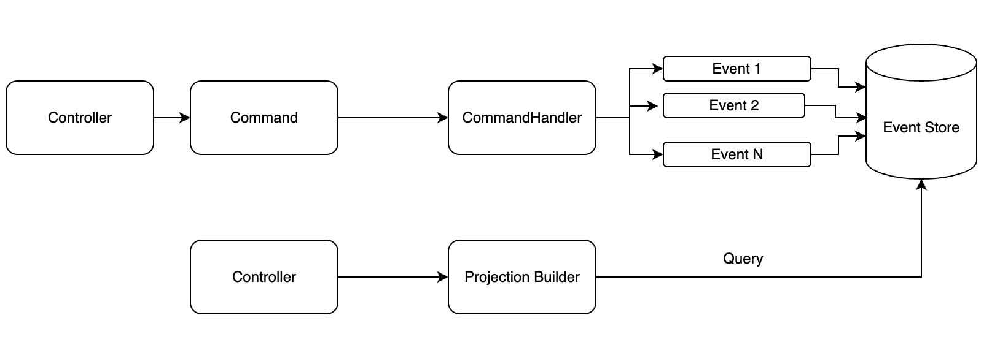

# Codenip Event Sourcing with PHP + Symfony

This repository contains an example of Event Sourcing architecture using Symfony and PHP

## Content
- PHP-APACHE container running version 8.2
- MySQL container running version 8.2.0

## Instructions
- `make build` to build the containers
- `make start` to start the containers
- `make stop` to stop the containers
- `make restart` to restart the containers
- `make prepare` to install dependencies with composer (once the project has been created)
- `make logs` to see application logs
- `make ssh` to SSH into the application container

UML of this example

